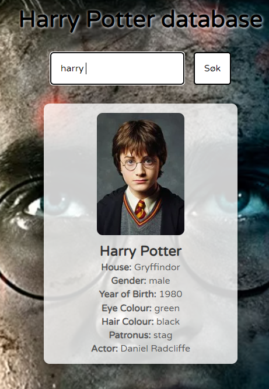

# Harry Potter Database

This project is a simple web application that allows users to search for Harry Potter characters using an input field. The application fetches character data from the HP API and displays relevant details about the character.

## Features
- Search for characters by name.
- Displays character details such as house, gender, year of birth, and more.
- Background image and styling to enhance user experience.

## Technologies Used
- HTML
- CSS
- JavaScript
- Fetch API

## How to Use
1. Clone the repository to your local machine.
2. Open the `index.html` file in a web browser.
3. Type the name of a Harry Potter character in the search box and click the "Søk" button or press "Enter".
4. View the character details displayed on the page.

## Code Snippet

Below is an example of the code used in this project:

### HTML
```html
<!DOCTYPE html>
<html lang="en">

<head>
    <meta charset="UTF-8">
    <meta name="viewport" content="width=device-width, initial-scale=1.0">
    <link rel="stylesheet" href="styles.css">
    <title>Harry Potter</title>
</head>

<body>
    <h1>Harry Potter database</h1>
    <div class="input">
        <input id="input" type="text" placeholder="Søk for en karakter">
        <button onclick="search()" type="button">Søk</button>
    </div>
    <div class="results"></div> 
    <script src="script.js"></script>
</body>

</html>
```

### CSS
```css
@import url("https://fonts.googleapis.com/css2?family=Varela+Round&display=swap");

* {
  padding: 0;
  margin: 0;
  font-family: "Varela Round", sans-serif;
}

body {
  background-image: url(./img/77fa6665-cff1-421d-bfd7-dba70f50c662.avif);
  background-size: cover;
}

h1 {
  font-size: 2.5rem;
  text-align: center;
  text-shadow: white 1px 1px 4px;
  padding-top: 2rem;
}

.input {
  display: flex;
  justify-content: center;
  padding-top: 2rem;
}

#input {
  padding: 1rem;
  font-size: 1rem;
  border: 2px solid black;
  border-radius: 5px;
  margin-right: 0.5rem;
}

#input::placeholder {
  color: black;
}

button {
  padding: 1rem;
  font-size: 1rem;
  border: 2px solid black;
  border-radius: 5px;
  background-color: white;
  margin-left: 0.5rem;
}

.character {
  text-align: center;
  margin-top: 2rem;
  background-color: rgba(255, 255, 255, 0.8);
  padding: 1rem;
  border-radius: 10px;
  width: 300px;
  margin: 2rem auto;
  box-shadow: 0 4px 8px rgba(0, 0, 0, 0.2);
}

.character img {
  width: 150px;
  height: auto;
  border-radius: 10px;
}

.character h2 {
  font-size: 1.5rem;
  margin-top: 0.5rem;
  color: #333;
}

.character p {
  font-size: 1rem;
  margin-top: 0.2rem;
  color: #555;
}
```

### JavaScript
```javascript
let url = "https://hp-api.onrender.com/api/characters";

function search() {
  let input = document.getElementById("input").value.toLowerCase();

  fetch(url)
    .then((response) => response.json())
    .then((data) => {
      const container = document.querySelector(".results");
      container.innerHTML = ""; 
      const character = data.find(char => char.name.toLowerCase().includes(input));

      if (character) {
        container.innerHTML += `
          <div class="character">
            
            <h2>${character.name}</h2>
            <p><strong>House:</strong> ${character.house || "Unknown"}</p>
            <p><strong>Gender:</strong> ${character.gender || "Unknown"}</p>
            <p><strong>Year of Birth:</strong> ${character.yearOfBirth || "Unknown"}</p>
            <p><strong>Eye Colour:</strong> ${character.eyeColour || "Unknown"}</p>
            <p><strong>Hair Colour:</strong> ${character.hairColour || "Unknown"}</p>
            <p><strong>Patronus:</strong> ${character.patronus || "N/A"}</p>
            <p><strong>Actor:</strong> ${character.actor || "Unknown"}</p>
          </div>`;
      } else {
        container.innerHTML = `<p>No character found</p>`;
      }
    })
    .catch((error) => {
      console.error("Error:", error);
      container.innerHTML = `<p>Something went wrong. Please try again later.</p>`;
    });
}

document.getElementById("input").addEventListener("keydown", function(event) {
  if (event.key === "Enter") {
    search();  
  }
});
```

## Screenshot


## License
This project is licensed under the MIT License. See the LICENSE file for more details.
